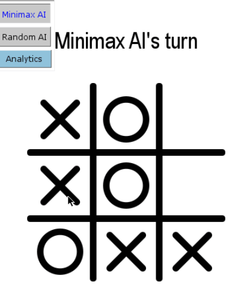

# Tic Tac Toe AI

<div align="center">

</div>
<center>
<b>A TicTacToe game I created using PyGame. </b>
</center>

## Table of Contents
- [Tic Tac Toe AI](#tic-tac-toe-ai)
  - [Table of Contents](#table-of-contents)
- [About](#about)
- [Installing Dependencies](#installing-dependencies)
- [Frontend GUI](#frontend-gui)
  - [Minimax AI](#minimax-ai)
  - [Random AI](#random-ai)
  - [Game Analytics](#game-analytics)
- [Backend Server](#backend-server)
  - [Running the tests](#running-the-tests)

# About

You have the ability to play TicTacToe against two AI opponents, [one chooses a move randomly](#random-ai), [while the other uses the MiniMax Algorithm](#minimax-ai) to find the move bringing it closest to victory. Furthermore, I had created a [backend server](#backend-server) to record the wins, losses, and draws. 

Before I created this project, I had a hard time getting my head around Object Oriented Programming. While I had understood the basic concept of classes, the tutorials I followed fell flat. With the various small programs I created, the extra complexity of OOP didn't seem to be quite worth it. Therefore, I decided to make a project combining everything I had learnt so far, .

Half a year later, when taking a formal Object Oriented Programming course at University, I realized that I had already 

This project is what got me into Object Oriented Programming, and at the time, this was my proudest piece of work. Each component of the project strained the skills I had obtained to the limit, and I had split the project into two parts, the frontend, and the backend.

# Installing Dependencies

Before being able to run the program, **you will need to install some dependencies**.
If you have never worked with external libraries in Python before, the process may be a bit confusing. 
To avoid installing libraries globally in python, I typically use [pipenv](https://pypi.org/project/pipenv/). This combines [pip](https://pypi.org/project/pip/) and [venv](https://docs.python.org/3/library/venv.html) together into a single . If you have multiple projects using different library versions, installing your dependencies to a virtual environment ensures that you have the right version for the each project. 


If using `pipenv`:
```
pipenv shell
pipenv install
```

Else, if using `pip`:
```
pip install requirements.txt
```

Afterwards, you will hopefully be able to run the program
```
python tictactoe.py
```


# Frontend GUI 
I had initially created the core game logic to be independant from the GUI, to prevent any dependencies with PyGame. After a few days of writing unit tests and perfecting the MiniMax AI, the code was ready to be put together into the GUI. 


Magic Numbers

After handling I/O and Exceptions, I created a game loop and brought everything together with Pygame. To add a personal touch to the UI, I had created all the SVG assets myself using Inkscape.

However, I decided that I wanted to go deeper into the project, and visualize the games won and lost using Matplotlib. Storing the data locally felt like an easy solution, so I created a backend server instead. As Python is limited to a single thread due to Global Interpreter Lock, I created a new process to request the data and display it via Matplotlib. Furthermore, the AI felt too fast at times, which I fixed with multithreading.

## Minimax AI
Recursively finds the best move for the current Grid State.

<div align="center">


</div>

## Random AI
Randomly chooses a position

<div align="center">


</div>

## Game Analytics
Displays the data stored on the [Flask backend](https://github.com/RyanSamman/Flask-TicTacToe) as a Pie Chart


# Backend Server
I decided that I wanted to try out backend technologies other than Node.js and MongoDB, and after doing Harvard's CS50x, I had learnt an alternative. For this project, I used Flask and PostgreSQL, which I used to create an endpoint to add and retrieve game scores. Afterwards, I deployed the server to the cloud to be used alongside my Frontend GUI.


## Running the tests
This step is optional, and just tests if the core functionality is working.

Once you've installed the dependencies, run:
```
pytest
```
