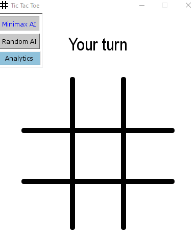
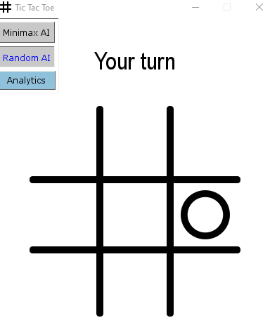
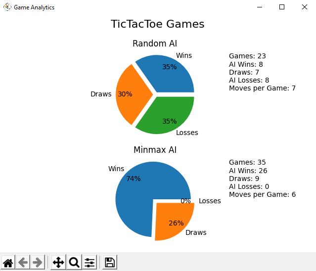

# Contents
- [Minimax AI](##Minimax-AI)
- [Random AI](##Random-AI)
- [Game Analytics](##Game-analytics)
- [Installation](##Installing-dependencies)
- [Tests](#Running-the-tests)

## Minimax AI
Recursively finds the best move for the current Grid State



## Random AI
Randomly chooses a position



## Game Analytics
Displays the data stored on the [Flask backend](https://github.com/RyanSamman/Flask-TicTacToe) as a Pie Chart



## Installing Dependencies
If using `pipenv`:
```
pipenv shell
pipenv install
```

Else, if using `pip`:
```
pip install requirements.txt
```

Afterwards, you will hopefully be able to run the program
```
python tictactoe.py
```

## Running the tests
This step is optional, and just tests if the core functionality is working.

Once you've installed the dependencies, run:
```
pytest
```
